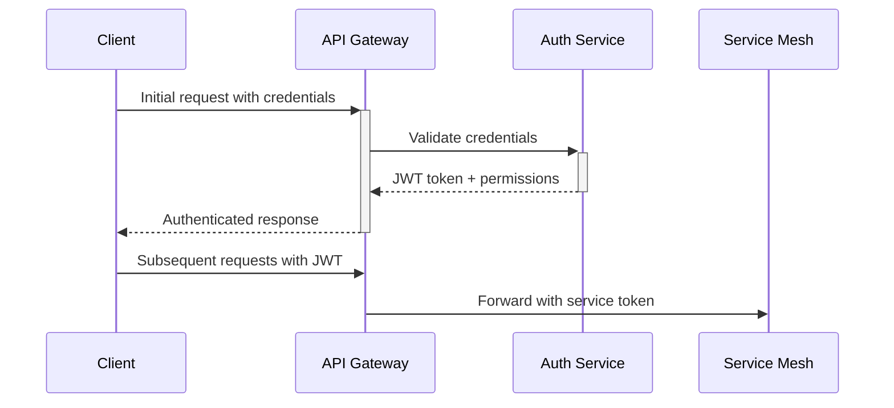

# ELIAS Brain Extension - Complete Component Communication Map

## Overview
This document maps every component interaction in the ELIAS Brain Extension system, defining how all micro-services, LoRAs, federation nodes, and client applications communicate with each other.

## Architecture Layers

### 1. CLIENT LAYER
- **Client Daemons** (JavaScript/Python/Elixir)
- **Mobile Apps** (iOS/Android)
- **Desktop Applications** (Windows/macOS/Linux)
- **Web Interfaces** (React/Vue/Angular)
- **Edge Devices** (IoT/Embedded)

### 2. API GATEWAY LAYER
- **Main API Gateway** (Elixir/Phoenix)
- **Federation Gateway** (Go/Rust)
- **LoRA Management Gateway** (Python/FastAPI)
- **Analytics Gateway** (Scala/Akka)

### 3. SERVICE MESH LAYER
- **User Management Service**
- **LoRA Orchestration Service**
- **Daemon Generation Service**
- **Federation Coordination Service**
- **Analytics & Monitoring Service**

### 4. AI PROCESSING LAYER
- **μTransfer Service** (Python/PyTorch)
- **GFlowNet Service** (Python/JAX)
- **Amortized Inference Service** (Python/Transformers)
- **mLoRA Training Service** (Python/CUDA)

### 5. FEDERATION LAYER
- **Primary Federation Nodes**
- **Regional Federation Nodes**
- **Edge Federation Nodes**
- **Corporate Federation Nodes**

### 6. STORAGE LAYER
- **User Data Stores** (PostgreSQL)
- **LoRA Weight Stores** (MinIO/S3)
- **Training Data Lakes** (Delta Lake)
- **Analytics Warehouses** (ClickHouse)

---

## Component Communication Protocols

### A. CLIENT ↔ API GATEWAY COMMUNICATIONS

#### 1. Client Daemon → Main API Gateway
```yaml
Protocol: HTTPS/WebSocket
Authentication: JWT + Device Certificates
Endpoints:
  - POST /api/v1/users/{user_id}/input
  - WebSocket /ws/realtime/{user_id}
  - GET /api/v1/users/{user_id}/daemon/status
  - POST /api/v1/users/{user_id}/daemon/update
Frequency: Real-time (WebSocket) + Periodic heartbeats (30s)
Data Format: JSON with Protocol Buffers for binary data
```

#### 2. Mobile App → Main API Gateway
```yaml
Protocol: HTTPS/GraphQL
Authentication: OAuth2 + Biometric
Endpoints:
  - POST /graphql (unified endpoint)
  - POST /api/v1/auth/mobile/login
  - GET /api/v1/users/{user_id}/forest/summary
Frequency: On-demand + Background sync (5min)
Data Format: GraphQL JSON
```

#### 3. Web Interface → Main API Gateway
```yaml
Protocol: HTTPS/REST + Server-Sent Events
Authentication: JWT + CSRF tokens
Endpoints:
  - GET /api/v1/dashboard/{user_id}
  - POST /api/v1/creative/generate
  - SSE /api/v1/events/{user_id}
Frequency: Interactive + Real-time updates
Data Format: JSON
```

---

### B. API GATEWAY ↔ SERVICE MESH COMMUNICATIONS

#### 1. Main API Gateway ↔ User Management Service
```yaml
Protocol: gRPC over HTTP/2
Service Discovery: Consul/etcd
Load Balancing: Round Robin with Health Checks
Endpoints:
  - rpc GetUser(GetUserRequest) returns (UserResponse)
  - rpc UpdateUserPreferences(UpdatePrefsRequest) returns (UpdateResponse)
  - rpc ValidateUserAccess(ValidateRequest) returns (ValidateResponse)
Circuit Breaker: Hystrix pattern (5 failures → open for 30s)
Retry Policy: Exponential backoff (max 3 retries)
```

#### 2. Main API Gateway ↔ LoRA Orchestration Service
```yaml
Protocol: gRPC + Message Queue (RabbitMQ)
Async Patterns: Request-Reply + Pub/Sub
Endpoints:
  - rpc CreateLoRA(CreateLoRARequest) returns (CreateLoRAResponse)
  - rpc TrainLoRAForest(TrainForestRequest) returns (stream TrainingUpdate)
  - Queue: lora.training.requests
  - Exchange: lora.events (fanout)
Timeout: 30s for sync, unlimited for async training
Backpressure: Flow control with 1000 message buffer
```

#### 3. Main API Gateway ↔ Daemon Generation Service
```yaml
Protocol: HTTP/2 + WebSocket (for streaming)
Endpoints:
  - POST /internal/daemon/generate
  - WebSocket /internal/daemon/stream/{generation_id}
  - GET /internal/daemon/status/{generation_id}
Streaming: Code generation progress + compilation status
Caching: Generated daemons cached for 1 hour
Compression: Gzip for REST, LZ4 for WebSocket
```

---

### C. SERVICE MESH INTERNAL COMMUNICATIONS

#### 1. LoRA Orchestration ↔ μTransfer Service
```yaml
Protocol: gRPC with Protocol Buffers
Service Mesh: Istio/Linkerd
Endpoints:
  - rpc SetupMuPScaling(MuPConfigRequest) returns (ScalingConfigResponse)
  - rpc TransferHyperparameters(TransferRequest) returns (TransferResponse)
  - rpc ValidateCoordinateCheck(ValidateRequest) returns (ValidationResponse)
Authentication: mTLS certificates
Telemetry: OpenTelemetry traces
Rate Limiting: 100 RPS per service instance
```

#### 2. LoRA Orchestration ↔ GFlowNet Service (JAX-based)
```yaml
Protocol: HTTP/2 with JSON + JAX-RPC for vectorized operations
Framework: JAX with Flax for neural networks
Endpoints:
  - POST /internal/gflownet/discover-architectures (JAX vectorized)
  - POST /internal/gflownet/sample-creative (JAX vmap batching)
  - POST /internal/gflownet/finetune-distribution (JAX pmap multi-GPU)
  - RPC /jax/vectorized-sampling (custom JAX-RPC protocol)
Connection Pooling: 20 persistent connections
Timeout: 300s for architecture discovery, 60s for creative sampling
JAX Optimizations: JIT compilation, XLA backend, automatic vectorization
Retry Strategy: Circuit breaker with jitter
```

#### 3. LoRA Orchestration ↔ Amortized Inference Service (PyTorch-based)
```yaml
Protocol: gRPC streaming
Framework: PyTorch with Transformers library
Endpoints:
  - rpc SamplePosterior(stream SampleRequest) returns (stream SampleResponse)
  - rpc BayesianAverage(AverageRequest) returns (AverageResponse)
  - rpc TrainAmortizedNetwork(TrainRequest) returns (stream TrainingProgress)
Streaming: Bidirectional for posterior sampling
Batching: 10-100 samples per batch
PyTorch Optimizations: TorchScript compilation, ONNX export for inference
Model Serving: TorchServe with auto-scaling
Flow Control: Credit-based windowing
```

#### 4. LoRA Orchestration ↔ mLoRA Training Service (PyTorch-based)
```yaml
Protocol: gRPC + Message Queue (Apache Kafka)
Framework: PyTorch with PEFT (Parameter-Efficient Fine-Tuning) library
Endpoints:
  - rpc InitiateConcurrentTraining(TrainingRequest) returns (TrainingJobResponse)
  - Kafka Topic: mlora.training.jobs
  - Kafka Topic: mlora.training.progress
  - Kafka Topic: mlora.training.completed
PyTorch Optimizations: 
  - FSDP (Fully Sharded Data Parallel) for memory efficiency
  - Gradient checkpointing for large models
  - Mixed precision training (FP16/BF16)
Model Management: Hugging Face Hub integration
Partitioning: By user_id for ordered processing
Replication: 3x replication across availability zones
Retention: 7 days for progress logs, 30 days for job history
```

---

### D. FEDERATION LAYER COMMUNICATIONS

#### 1. Client ↔ Federation Node
```yaml
Protocol: HTTPS + WebRTC (for P2P)
Authentication: Federation certificates + user tokens
Endpoints:
  - POST /api/v1/federation/clients/{client_id}/register
  - POST /api/v1/federation/clients/{client_id}/heartbeat
  - WebRTC DataChannel for direct model weights transfer
Heartbeat: Every 30 seconds with exponential backoff on failure
Failover: Automatic failover to backup federation node
```

#### 2. Federation Node ↔ Federation Node
```yaml
Protocol: gRPC over mTLS + Gossip Protocol (SWIM)
Consensus: Raft algorithm for coordination decisions
Endpoints:
  - rpc ProposeDecision(ProposalRequest) returns (ProposalResponse)
  - rpc SyncState(SyncRequest) returns (stream StateUpdate)
  - UDP Gossip for membership and health
Election Timeout: 150-300ms randomized
Log Replication: Batch size 100 entries
Network Partitions: Split-brain protection via quorum
```

#### 3. Federation Node ↔ Storage Layer
```yaml
Protocol: HTTP/S3 API + Database connections
Endpoints:
  - PUT /lora-weights/{user_id}/{lora_id}/weights.bin
  - GET /lora-weights/{user_id}/{lora_id}/metadata.json
  - PostgreSQL connection pool: 50 connections per node
  - MinIO/S3: Presigned URLs for large file transfers
Consistency: Read-after-write for metadata, eventual for weights
Caching: 2-layer cache (Redis + local memory)
```

---

### E. AI PROCESSING LAYER COMMUNICATIONS

#### 1. μTransfer Service ↔ Training Infrastructure
```yaml
Protocol: CUDA/NCCL for multi-GPU + HTTP for coordination
Endpoints:
  - POST /internal/mutransfer/setup-scaling
  - WebSocket /internal/mutransfer/coordinate-check
  - NCCL AllReduce for gradient synchronization
GPU Topology: NVLink for intra-node, InfiniBand for inter-node
Memory Management: Unified memory with 80% GPU utilization target
Checkpointing: Every 100 steps with incremental saves
```

#### 2. GFlowNet Service ↔ Architecture Search
```yaml
Protocol: gRPC + Shared Memory (for model weights)
Endpoints:
  - rpc SearchArchitectures(SearchRequest) returns (stream Architecture)
  - Shared memory segment: /dev/shm/gflownet_{job_id}
  - rpc EvaluateArchitecture(EvalRequest) returns (EvalResponse)
Parallelization: 4-16 worker processes per architecture evaluation
Resource Allocation: Dynamic based on search complexity
Result Caching: LRU cache with 10GB limit
```

#### 3. Amortized Inference Service ↔ Model Serving
```yaml
Protocol: Triton Inference Server + gRPC
Endpoints:
  - gRPC model serving on port 8001
  - HTTP health checks on port 8000
  - Prometheus metrics on port 8002
Model Versioning: A/B testing with gradual rollout
Auto-scaling: Based on queue length and latency
Batching: Dynamic batching with 10ms timeout
```

---

### F. STORAGE LAYER COMMUNICATIONS

#### 1. PostgreSQL Cluster Communications
```yaml
Protocol: PostgreSQL protocol + Patroni for HA
Replication: Streaming replication with 3 replicas
Failover: Automatic with 30s RTO/RPO
Connection Pooling: PgBouncer with 1000 connection limit
Backup: Continuous WAL-E to object storage
Partitioning: By user_id and time-based for analytics
```

#### 2. Object Storage (MinIO/S3) Communications
```yaml
Protocol: S3 API over HTTPS
Multipart Upload: For files >5MB
Lifecycle Policies: Transition to IA after 30 days, Glacier after 90 days
Encryption: Server-side with KMS
Versioning: Enabled for LoRA weights with 10 version limit
Cross-Region Replication: For disaster recovery
```

#### 3. Analytics Warehouse (ClickHouse) Communications
```yaml
Protocol: ClickHouse native protocol + HTTP for queries
Partitioning: By date and user_id
Materialized Views: Pre-aggregated metrics tables
Replication: Multi-master with conflict resolution
Data Ingestion: Kafka Connect for real-time streaming
Query Optimization: Column-oriented with compression
```

---

## Message Formats and Schemas

### 1. User Input Message
```protobuf
message UserInputMessage {
  string user_id = 1;
  string session_id = 2;
  InputType type = 3;
  bytes content = 4;
  map<string, string> metadata = 5;
  int64 timestamp = 6;
  
  enum InputType {
    TEXT = 0;
    VOICE = 1;
    MULTIMODAL = 2;
  }
}
```

### 2. LoRA Training Job
```protobuf
message LoRATrainingJob {
  string job_id = 1;
  string user_id = 2;
  repeated LoRAConfig loras = 3;
  TrainingData data = 4;
  TrainingConfig config = 5;
  int32 priority = 6;
  
  message LoRAConfig {
    string lora_id = 1;
    string domain = 2;
    int32 rank = 3;
    repeated string target_layers = 4;
  }
}
```

### 3. Federation Sync Event
```protobuf
message FederationSyncEvent {
  string event_id = 1;
  string source_node_id = 2;
  SyncType type = 3;
  bytes payload = 4;
  int64 timestamp = 5;
  string checksum = 6;
  
  enum SyncType {
    LORA_UPDATE = 0;
    USER_STATE = 1;
    CONFIGURATION = 2;
    HEALTH_STATUS = 3;
  }
}
```

---

## Error Handling and Fault Tolerance

### 1. Circuit Breaker Patterns
```yaml
Services with Circuit Breakers:
  - API Gateway → All downstream services
  - Federation Node → Storage Layer
  - Training Services → GPU Resources

Configuration:
  Failure Threshold: 5 consecutive failures
  Timeout: 30 seconds
  Recovery: Half-open after 60 seconds
```

### 2. Retry Strategies
```yaml
Exponential Backoff:
  Initial Delay: 100ms
  Max Delay: 30s
  Max Attempts: 3
  Jitter: ±25%

Retry Conditions:
  - Network timeouts
  - 5xx HTTP status codes
  - gRPC UNAVAILABLE/DEADLINE_EXCEEDED
```

### 3. Graceful Degradation
```yaml
Service Degradation Strategies:
  LoRA Training: Queue jobs, process when resources available
  Creative Generation: Fall back to simpler models
  Federation Sync: Cache locally, sync when connection restored
  Analytics: Store events locally, batch upload later
```

---

## Monitoring and Observability

### 1. Distributed Tracing
```yaml
Tracing System: Jaeger/Zipkin
Instrumentation: OpenTelemetry
Trace Sampling: 1% in production, 100% in development
Trace Context: Propagated via HTTP headers and gRPC metadata
```

### 2. Metrics Collection
```yaml
Metrics System: Prometheus + Grafana
Collection Interval: 15 seconds
Retention: 15 days (Prometheus), 1 year (Victoria Metrics)
Alerting: AlertManager with PagerDuty integration
```

### 3. Logging
```yaml
Log Format: Structured JSON with correlation IDs
Log Levels: ERROR, WARN, INFO, DEBUG
Log Aggregation: ELK Stack (Elasticsearch, Logstash, Kibana)
Log Retention: 30 days for DEBUG, 90 days for INFO+
```

---

## Security and Authentication

### 1. Authentication Flow


### 2. Authorization Policies
```yaml
RBAC Policies:
  - Users: Can access own data only
  - Admins: Can access user management APIs
  - Services: Can access internal APIs only
  - Federation Nodes: Can sync user data across nodes

API Rate Limits:
  - Authenticated users: 1000 req/min
  - Anonymous users: 100 req/min
  - Service-to-service: 10000 req/min
```

### 3. Data Encryption
```yaml
Encryption in Transit:
  - TLS 1.3 for all HTTP communications
  - mTLS for service-to-service
  - DTLS for UDP-based gossip protocol

Encryption at Rest:
  - AES-256 for user data
  - ChaCha20-Poly1305 for LoRA weights
  - Envelope encryption with key rotation
```

---

## Deployment and Scaling

### 1. Container Orchestration
```yaml
Platform: Kubernetes
Ingress: NGINX Ingress Controller with SSL termination
Service Mesh: Istio for traffic management
Auto-scaling: HPA based on CPU/memory, VPA for right-sizing
```

### 2. Database Scaling
```yaml
PostgreSQL: Read replicas + connection pooling
ClickHouse: Distributed tables across multiple shards
Redis: Cluster mode with 6 nodes (3 masters, 3 replicas)
MinIO: Distributed with 4 nodes minimum
```

### 3. AI Service Scaling
```yaml
GPU Scheduling: Kubernetes GPU device plugin
Model Serving: Triton Inference Server with auto-scaling
Training: Distributed across multiple GPU nodes
Resource Quotas: Per-user limits on training time and storage
```

This comprehensive communication map ensures every component knows exactly how to interact with every other component in the ELIAS Brain Extension ecosystem, from individual LoRA management to federation-wide coordination.